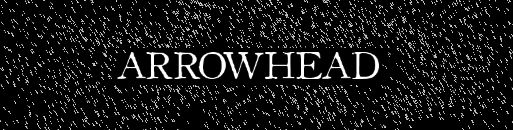

  Systems of Embedded Devices Sharing Physical Information and Simulating it Digitally

`arrowhead` is a collection of crates and binaries aimed at streaming real-world peripherals into simulated environments. Primarily through Raspberry Pi or Jetson Nano pins, these inputs about the world are collected and streamed to a centralized WebSocket server. This server then processes the information, interprets it, and represents it in a Bevy environment. 

The current goal of this project isn't set in stone, it's mostly just a means to finding out *how* to do most of this stuff and *what* we can do with it from there. 

### Crates:
* `consumer`: A simple Pi Program that Reads pitch and poll from a gy521 module and streams it as a sequence of bytes to a websocket server
* `renderer`: A websocket server/Bevy environment that asynchronously updates pitch and poll values upon receiving binary from `receiver`. Uses this pitch and poll data to rotate a cuboid accordingly
* `gy521-rppal`:
* `test_client`: 
